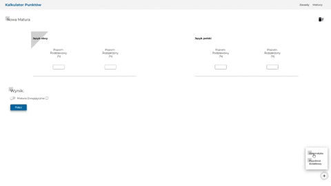

# Kalkulator Punktów

Aplikacja internetowa służąca do obliczenia punktów <br />
na Politechnikę Gdańską na każdy kierunek. <br />
`Na architekturę trzeba dodać do wyniku punkty z pierwszego etapu`

## Dostępne matury

- Nowa matura
- Stara matura
- Matura międzynarodowa

## Jak uruchomić?

Aby uruchomić lokalnie trzeba mieć zainstalowanego node'a i wykonać polecenie

```
npm start
```

Natomiast aby stworzyć build w folderze public gotowy na hosting

```
npm run build
```

## Skrawek tego jak aplikacja się prezentuje


